# VirtueMart plugin for Payme

## Установка

#### Требования

- Joomla 3.7.0
- Virtuemart 3.0.10
- Регистрация в кабинете поставщика [Paycom](http://paycom.uz/)

#### Настройка БД MySQL

1.1	Заходим в панель управления phpMyAdmin

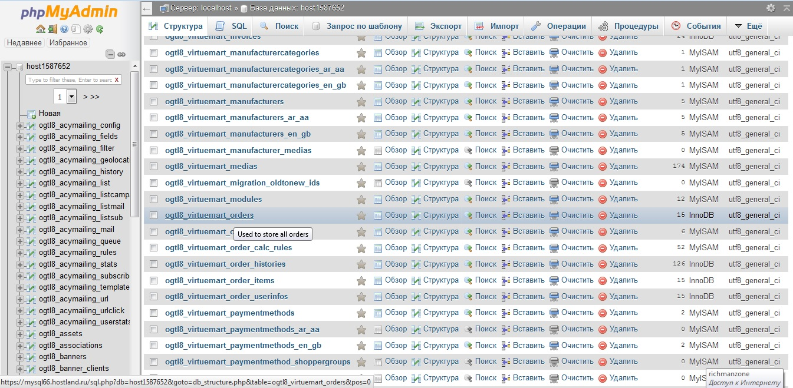

1.2	Открывем таблицу «___virtuemart_orders»

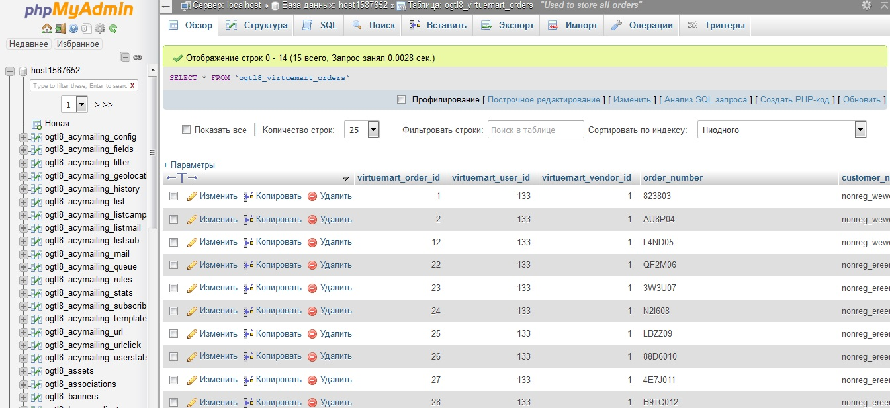

1.3	Переходим во вкладку «Структура» и вводим в поле «добавить» цифру 3, затем нажимаем «Вперед»

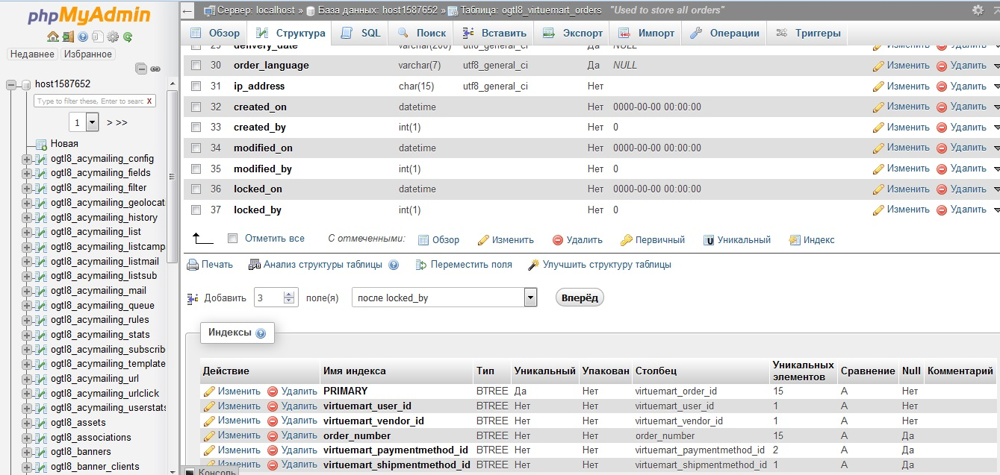

1.4	В открывшемся окне заполняем имена полей «create_time», «perform_time», «cancel_time» а так же тип «BIGINT». Нажимаем «Сохранить»

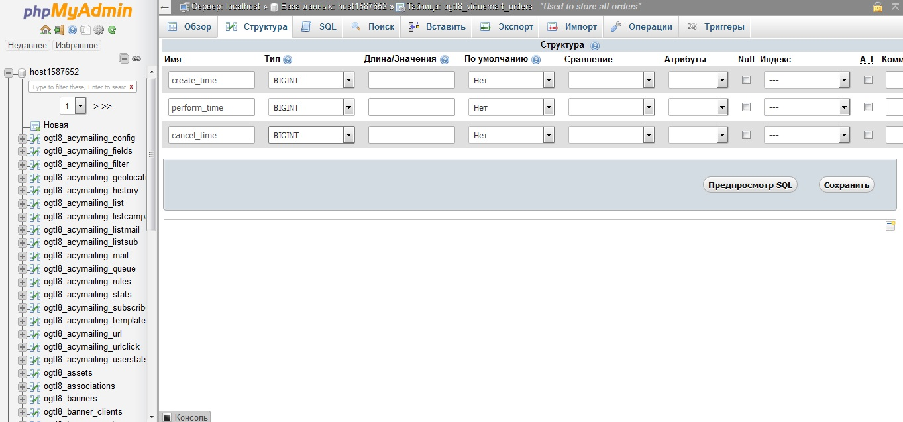

1.5	В таблицу добавились 3 столбца

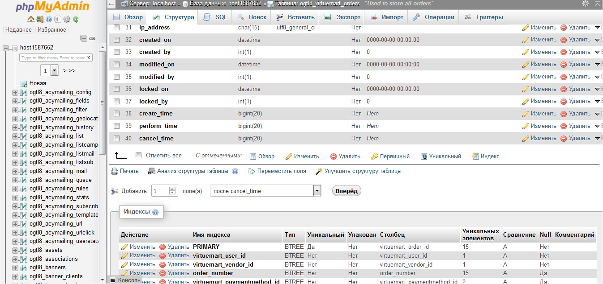

#### Установка модуля

2.1 Перейти на вкладку установки расширений Extensions->Manage->Install

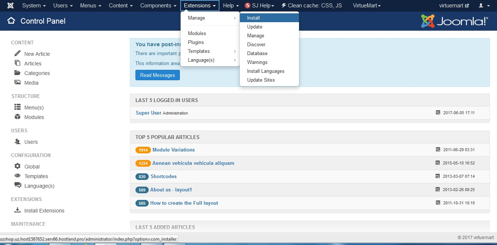

2.2 Перейти на вкладку Upload Package File и указать (или перетащить)  архив virtuemart-gateway-payme.zip

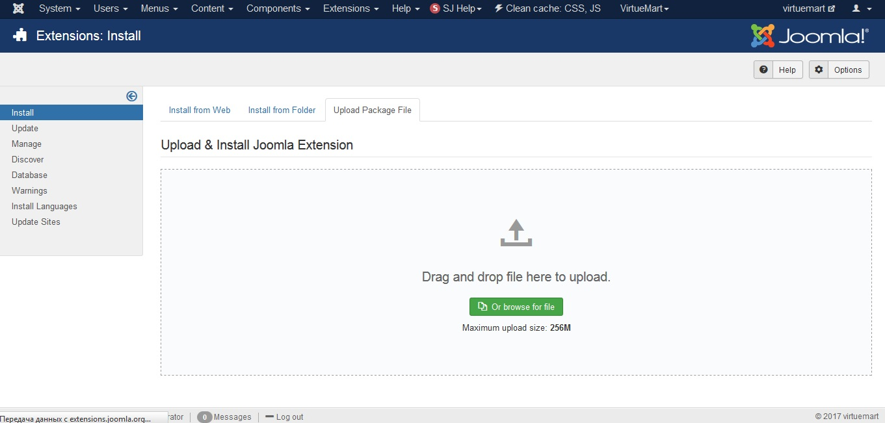

2.3 Успешная установка сопровождается сообщением

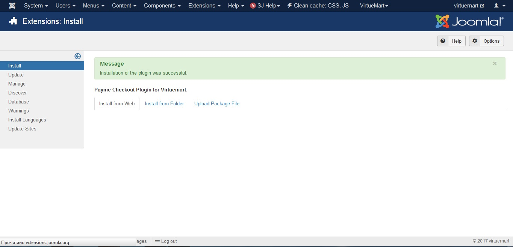

#### Настройка плагина

3.1 Переходим Virtuemart->Payment Methods

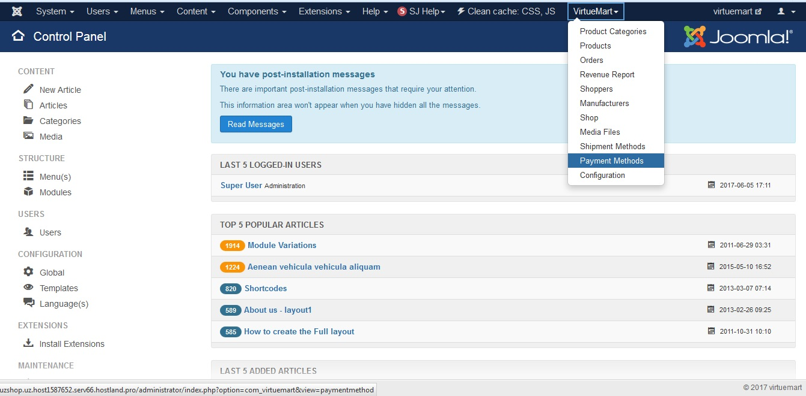

3.2 Нажимаем кнопку «New» и заполняем поля настройки метода оплаты:
Payment Name: Payme;
Self Alias: payme;
Published: yes;
Payment Method: Payme;
Description заполняется опционально
Нажимаем кнопку «Save»

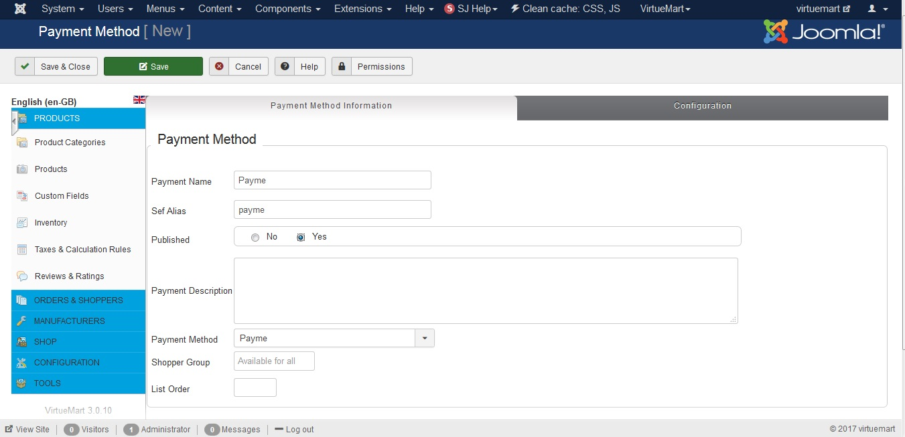

3.3 Переходим во вкладку «Configuration» и заполняем MERCHANT_ID и SECRET_KEY. Нажимаем «SAVE»
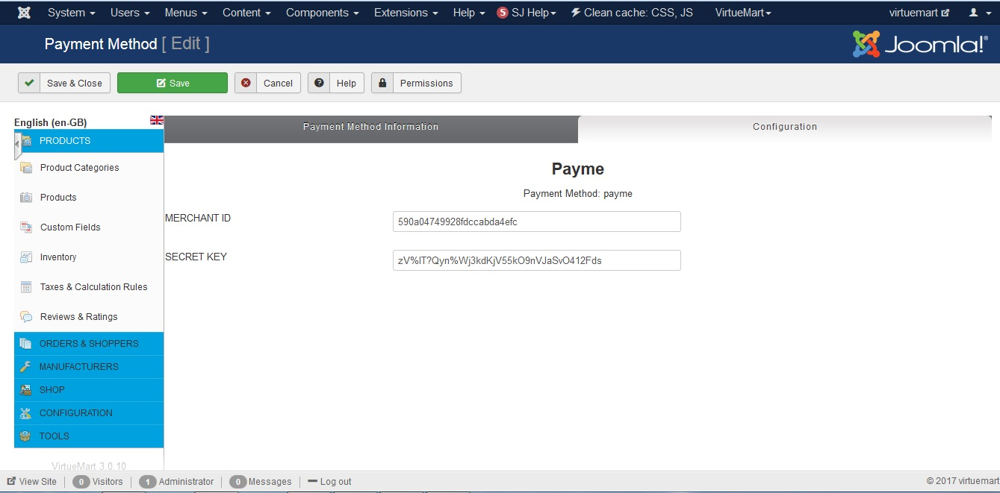

3.4 Настройка модуля завершена
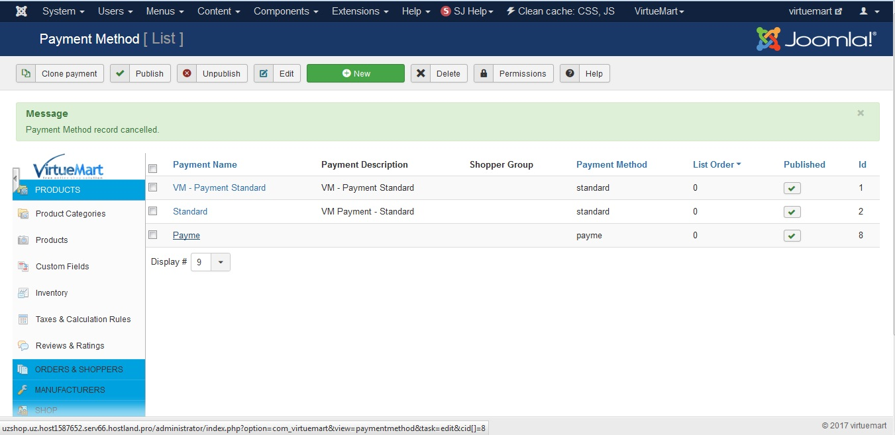

**Важно! В файле /plugins/vmpayment/payme/payme.php в строках 108 и 148 заменяем “7” на ID метода Payme (на скрине выше последний столбик – цифра “8”)**

